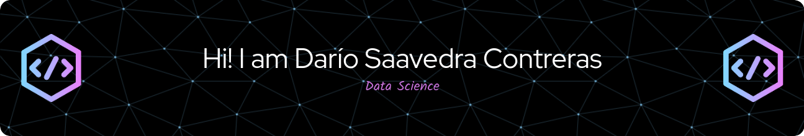

## About Me
Hey there! I’m a **Civil Engineer in Metallurgy** from the University of Santiago, Chile. Over time, my passion shifted towards the fascinating world of **Data Science** and **Machine Learning**. I'm currently in the final stretch of my **Master’s in Data Science** at the Pontifical Catholic University of Chile. 🎓

I love solving problems with data and constantly learning new technologies. Throughout my career, I’ve had the chance to work in various fields, from teaching to career management, and now in **Digital Transformation**. My favorite tools lately? Definitely **Python** and **SQL**! 🐍💻

## What Am I Up To?
Currently, I’m working as an **IT Engineer** at the Pontifical Catholic University of Chile. I’m part of the **Data Architecture** team, where I help manage quick and urgent data requests, making sure everything is in order. I’m also deeply involved in projects related to **data migration** and advanced data analysis using data cubes (sounds tricky, but it’s super fun when you do it with Python 😉).

Before this, I supported an exciting project where we implemented a platform for PhD competitions using No Code technologies. It was amazing to see how we optimized processes without writing a single line of code!

## What I’m Passionate About
- **Machine Learning**: There’s nothing like teaching a machine to learn by itself. 🤖
- **Data Analysis**: Numbers tell stories... you just have to know how to listen to them.
- **Python**: My go-to language for almost everything.
- **SQL**: The backbone of my databases.
- **No Code**: Because sometimes simplicity is the most powerful thing.

## Connect With Me
- [LinkedIn](https://www.linkedin.com/in/dar%C3%ADo-gonzalo-saavedra-contreras-1b089113a/)

